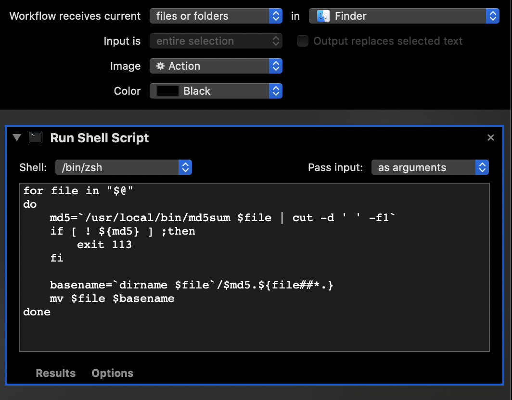

Mac 已经自带了文件批量重命名的功能。但只支持 Index、Counter、Date 三种模式。

我想直接用文件的 MD5 作为文件名。既避免重复，也不用动脑子命名。（虽然有一定可能会碰撞，但忽略不计）。

最后用 Mac 的 Automator 实现，可以有比较好的体验。

1. 打开 Automator，选择 Quick Action。
2. 选择 Run Shell Script
3. 编写脚本代码

脚本的代码如下：

```bash
for file in "$@"
do
	md5=`/usr/local/bin/md5sum $file | cut -d ' ' -f1`
  	if [ ! ${md5} ] ;then
    	exit 113
  	fi

	basename=`dirname $file`/${md5:0:6}.${file##*.}
  	mv $file $basename
done
```

最后像这样


